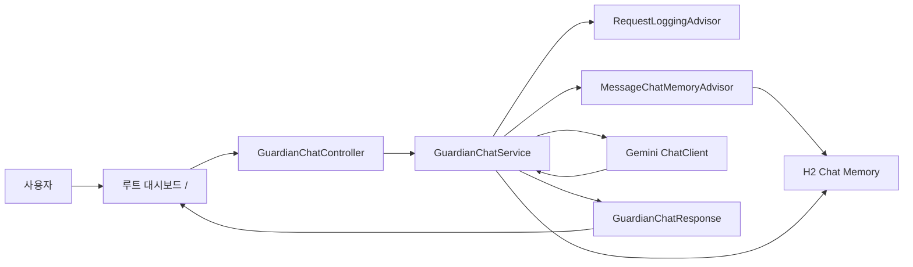

# Spring AI Study

Spring AI를 Day1부터 Day3까지 학습하면서 만든 실습 저장소입니다.
기본 호출, Prompt 설계, Structured Output, Advisor, Chat Memory, H2 연동, 미니 프로젝트까지 한 흐름으로 정리했습니다.

## 학습 범위

- Day1: `ChatClient` 첫 호출, `Controller -> Service -> ChatClient` 흐름 이해
- Day2: Prompt 설계, JSON/Object/List 형태의 Structured Output 실습
- Day3: Advisor, In-Memory Chat Memory, JDBC Chat Memory, H2 Console 확인
- Mini Project: CareLink 보호자 상담 AI 콘솔 구현

## 프로젝트 구성

| 폴더 | 내용 |
|---|---|
| `day01-chat-client` | `/api/chat`, `/api/teacher`, 기본 HTML UI |
| `day02-prompt-output` | 요약, 분류, JSON 응답, 객체 변환, 리스트 응답 |
| `day03-advisor-memory` | Advisor, Chat Memory, H2 기반 대화 저장 실습 |
| `carelink-ai-mariadb` | CareLink 보호자 상담 AI 콘솔, H2 파일 DB, 루트 대시보드 UI |
| `ch03-prompt` | Prompt Template, Few-shot, Role Assignment 등 실습 분석용 폴더 |

## 오늘 정리한 핵심

### 1. Day3 핵심 개념

- `Advisor`
  AI 호출 전후에 공통 로직을 끼워 넣는 장치입니다.
- `MessageChatMemoryAdvisor`
  같은 `conversationId`의 이전 대화를 불러와 문맥을 이어줍니다.
- `JdbcChatMemoryRepository`
  대화 메모리를 DB에 저장하는 저장소입니다.
- `H2 Console`
  브라우저에서 DB 테이블을 직접 조회할 수 있습니다.

### 2. Mini Project: CareLink Guardian Console

오늘 만든 미니 프로젝트는 단순 챗봇이 아니라, 보호자 질문을 받고 이전 대화를 기억하면서 응답하고, 그 기록을 실제 DB에 남기는 구조입니다.

핵심 흐름은 아래와 같습니다.



## 실행 방법

루트에서 모듈별로 실행해도 되고, IntelliJ에서 각 모듈을 따로 실행해도 됩니다.

### carelink-ai-mariadb 실행

```powershell
cd C:\Users\금정산2-PC02\p2-spring\spring-ai-study\carelink-ai-mariadb
.\gradlew.bat bootRun
```

### 접속 주소

- 홈 화면: [http://localhost:8080/](http://localhost:8080/)
- H2 콘솔: [http://localhost:8080/h2-console/](http://localhost:8080/h2-console/)
- API 예시:
  [http://localhost:8080/api/guardian-chat?question=안녕하세요&conversationId=demo-1](http://localhost:8080/api/guardian-chat?question=%EC%95%88%EB%85%95%ED%95%98%EC%84%B8%EC%9A%94&conversationId=demo-1)

## H2 확인 방법

### H2 Console

- Driver Class: `org.h2.Driver`
- JDBC URL: `jdbc:h2:file:./data/chatmemory`
- User Name: `sa`
- Password: 빈칸

조회 SQL:

```sql
SELECT * FROM SPRING_AI_CHAT_MEMORY;
```

### DBeaver

- JDBC URL:
  `jdbc:h2:file:C:/Users/금정산2-PC02/p2-spring/spring-ai-study/carelink-ai-mariadb/data/chatmemory;AUTO_SERVER=TRUE`
- User Name: `sa`
- Password: 빈칸

## 발표 포인트

- 단순 AI 응답이 아니라 `conversationId` 기준 대화 기억이 됩니다.
- H2 DB에 실제 저장되어 H2 Console과 DBeaver에서 검증할 수 있습니다.
- Day3에서 배운 `Advisor`와 `Chat Memory`를 미니 프로젝트에 연결했습니다.
- 루트 대시보드 UI를 만들어 발표와 시연이 쉬운 형태로 정리했습니다.

## 참고 자료

- 학습 로그: [STUDY_LOG.md](STUDY_LOG.md)
- Day3 코드 주석 정리: [DAY3_PDF_CODE_ANNOTATED.md](DAY3_PDF_CODE_ANNOTATED.md)
- Day1/Day2 발표 자료: `DAY1_DAY2_VISUAL.pptx`
