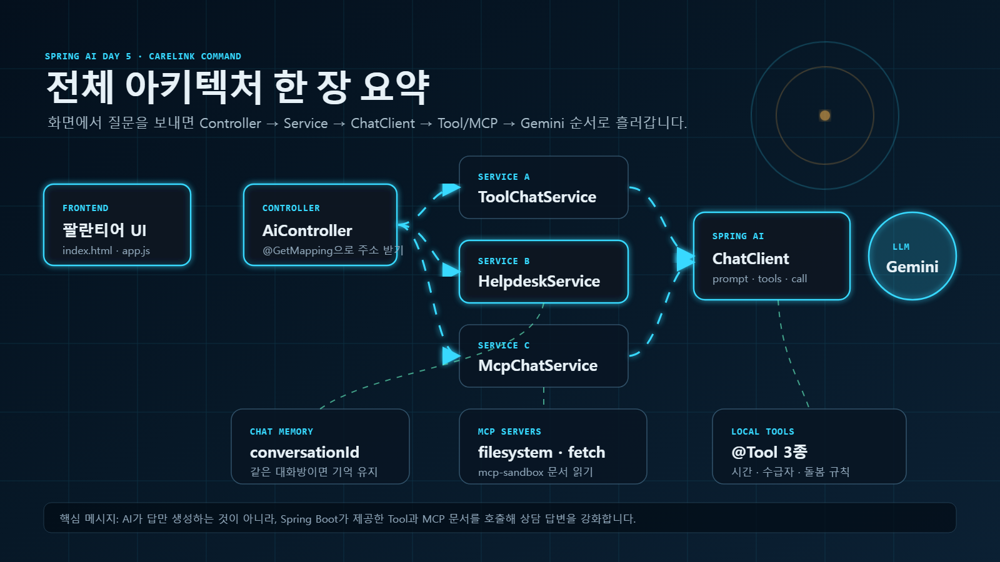
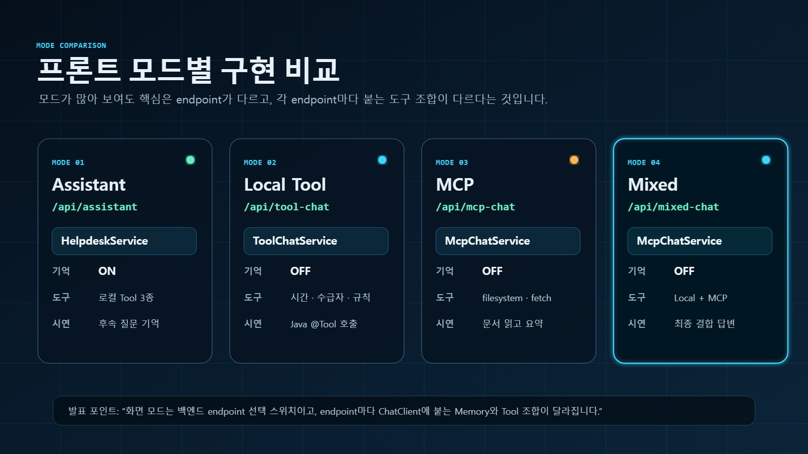
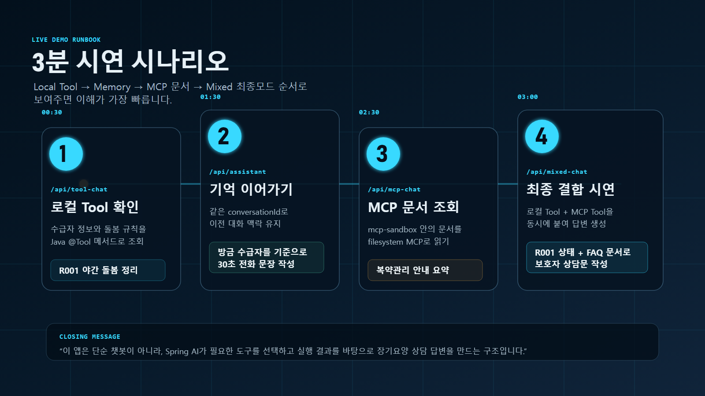

# CareLink AI Command

Spring AI Day5 수업 내용을 바탕으로 만든 **AI 장기요양 상담 헬퍼**입니다.

오늘 구현한 핵심은 단순 챗봇이 아니라, **Spring AI가 필요한 도구를 선택하고 실행 결과를 바탕으로 답변하는 구조**입니다.



## 오늘 만든 것

- Spring Boot + Spring AI 기반 장기요양 상담 API
- 로컬 `@Tool` 3종: 현재 시간, 수급자 정보, 돌봄 규칙
- Chat Memory 기반 후속 질문 처리
- MCP filesystem/fetch 도구 연결
- 로컬 Tool + MCP Tool을 함께 쓰는 Mixed Chat
- 팔란티어풍 프론트엔드 콘솔
- 발표용 시각화 이미지와 3분 시연 시나리오
- 파일별 주석 해설 문서

## 실행 방법

```powershell
cd C:\Users\금정산2-PC02\p2-spring\spring-ai-study\day05-tool-mcp
.\gradlew.bat bootRun
```

브라우저에서 접속합니다.

```text
http://localhost:8080/
```

API Key는 환경변수로 설정해야 합니다.

```powershell
setx GOOGLE_API_KEY "본인_API_KEY"
```

MCP 실행을 위해 아래 명령이 되는지도 확인합니다.

```powershell
cmd /c npx --version
uvx --version
```

## 프론트 사용법



화면에서 모드를 선택하고 질문을 입력한 뒤 `Ctrl + Enter`로 전송합니다.

| 화면 모드 | API | 역할 |
|---|---|---|
| Assistant | `/api/assistant` | 로컬 Tool + Chat Memory |
| Local Tool | `/api/tool-chat` | 로컬 Java `@Tool` 3종 |
| MCP | `/api/mcp-chat` | 외부 MCP 서버 도구 |
| Mixed | `/api/mixed-chat` | 로컬 Tool + MCP Tool 결합 |

`Assistant` 모드는 같은 `conversationId`를 유지하면 이전 질문을 기억합니다.

## 시연 시나리오



### 1. 로컬 Tool 확인

모드: `/api/tool-chat`

```text
R001 수급자의 상태와 야간 돌봄 주의사항을 함께 정리해주세요.
```

보여줄 점:

- AI가 수급자 정보 Tool을 호출합니다.
- AI가 돌봄 규칙 Tool을 함께 참고합니다.

### 2. Chat Memory 확인

모드: `/api/assistant`

conversationId:

```text
carelink-demo-01
```

첫 질문:

```text
R001 수급자의 야간 돌봄 주의사항과 보호자에게 전달할 안내문을 작성해주세요.
```

후속 질문:

```text
방금 말한 수급자를 기준으로, 보호자에게 전화할 때 30초 안에 말할 수 있는 문장으로 정리해주세요.
```

보여줄 점:

- 두 번째 질문에는 `R001`을 다시 말하지 않습니다.
- 같은 `conversationId`라서 이전 대화가 이어집니다.

### 3. MCP 문서 조회

모드: `/api/mcp-chat`

```text
mcp-sandbox에 있는 복약관리-안내.md 내용을 읽고 보호자에게 전달할 내용으로 요약해주세요.
```

보여줄 점:

- Java 코드 안의 고정 데이터가 아니라 MCP filesystem 서버가 문서를 읽습니다.
- `mcp-sandbox` 폴더가 MCP 서버의 접근 가능한 문서함 역할을 합니다.

### 4. Mixed 최종 시연

모드: `/api/mixed-chat`

```text
R001 상태를 확인하고 보호자-상담-FAQ.md에서 낙상 위험 안내도 같이 찾아서 보호자 상담 문장으로 정리해주세요.
```

보여줄 점:

- 수급자 상태는 로컬 Java Tool에서 가져옵니다.
- 보호자 상담 문서는 MCP Tool에서 가져옵니다.
- 두 도구 결과를 합쳐 최종 답변을 만듭니다.

## 구현 구조

```text
Frontend
  └─ static/index.html, styles.css, app.js
      ↓ fetch()
AiController
  └─ URL별로 Service 호출
      ↓
Service
  ├─ ChatService: 기본 챗
  ├─ ToolChatService: 로컬 Tool Calling
  ├─ HelpdeskService: Tool + Chat Memory
  └─ McpChatService: MCP / Mixed Chat
      ↓
ChatClient
  └─ prompt → tools → call → content
      ↓
Gemini
```

## 주요 파일

| 파일 | 설명 |
|---|---|
| `src/main/java/com/study/day05toolmcp/AiController.java` | 모든 API 요청 입구 |
| `service/ToolChatService.java` | 로컬 Tool Calling |
| `service/HelpdeskService.java` | Tool + Chat Memory |
| `mcp/McpChatService.java` | MCP Tool 연결 |
| `mcp/McpToolCatalog.java` | MCP 서버 도구 수집 |
| `tool/DateTimeTools.java` | 현재 시간 Tool |
| `tool/CustomerTools.java` | 수급자 정보 Tool |
| `tool/CompanyRuleTools.java` | 돌봄 규칙 Tool |
| `src/main/resources/static/` | 프론트엔드 화면 |
| `mcp-sandbox/` | MCP filesystem이 읽는 문서 폴더 |
| `presentation/` | 발표용 이미지 |
| `DAY5_ANNOTATED_CODE.md` | 파일별 전체 주석 해설 |

## 발표 멘트

```text
이 프로젝트는 단순 챗봇이 아니라 Spring Boot API 위에서 Spring AI ChatClient가 Tool Calling, Chat Memory, MCP를 연결해 장기요양 상담을 보조하는 구조입니다.
AI가 답만 생성하는 것이 아니라, 필요한 도구를 선택하고 실행 결과를 바탕으로 답변을 만듭니다.
```

## 주의

- 실제 API Key는 코드나 GitHub에 올리지 않습니다.
- `data/`, H2 DB 파일, 개인 테스트 파일은 커밋하지 않습니다.
- 이 프로젝트는 장기요양 상담 보조 예시이며, 의료적·법적 최종 판단은 담당자나 전문기관 확인이 필요합니다.
